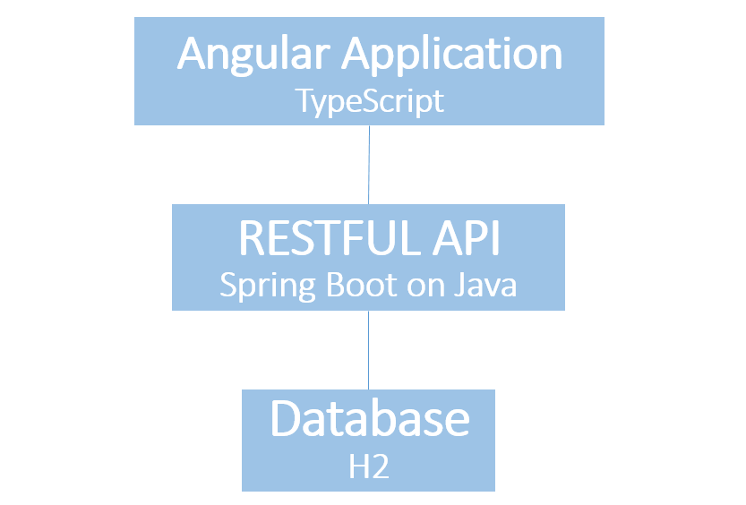
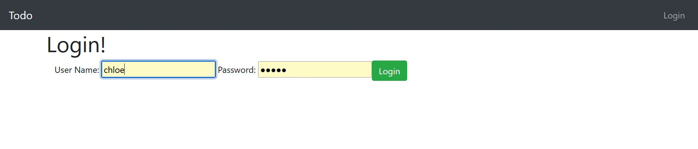
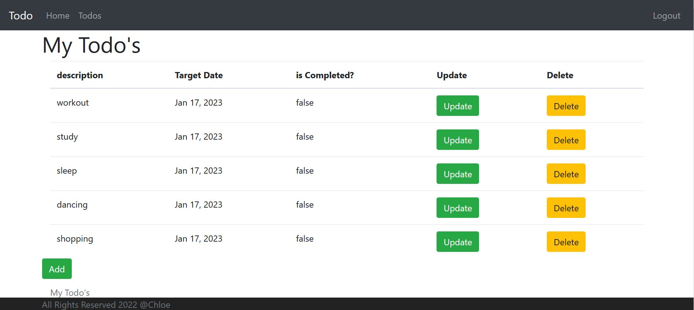
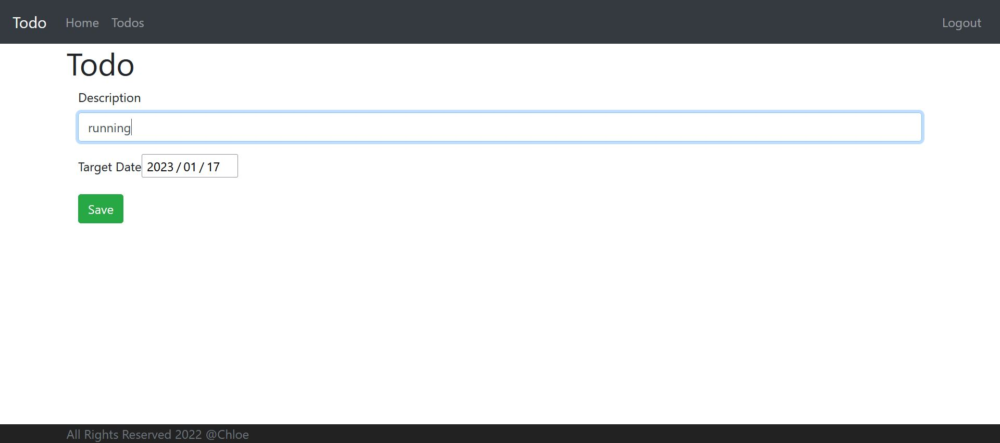
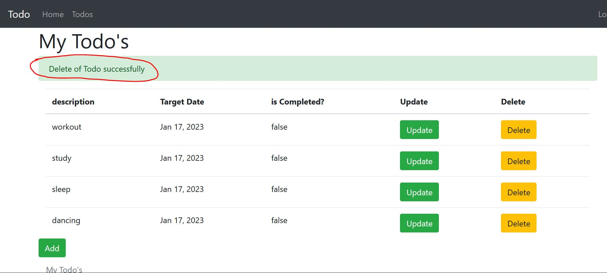

# Todo-List-App

# Intro

Todo List is an angular App with a RESTful API built on top of Spring Boot and Bootstrap for styling that users can manage their daily-life tasks efficiently. H2 is utilized as the in-memory database for storing data, allowing for a fast means of accessing the information. Basic Authentication is implemented with Spring Boot and Spring Security by storing user authentication token.

# Features

* Users can create, update and delete their todo items.
* Users can create an account, log in and log out.
* Each todo items have several attributes, including descriptions、target date and is-completed .
* Error and success messages are handled with flash messages to provide users with feedback.

